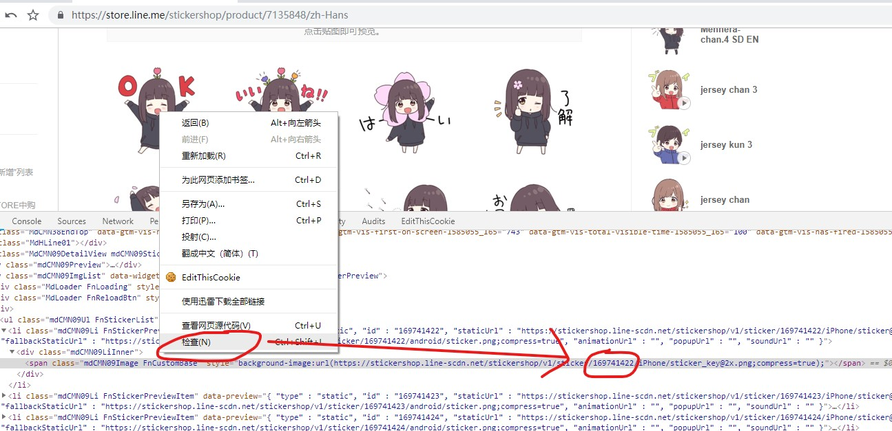

LineStickerDownloader
--------

本项目是一个用来下载[`line store`](http://store.line.cme/)上的贴图/主题封面的爬虫。

采用`Powershell`语言。

使用方法 Usage
--------

1. 在line store贴图`详情`界面`右击第一张贴图`，选择`审查元素（检查）`。

2. 获得如图所示ID号

3. 右键脚本文件`Line贴图下载.ps1`，选择`使用powershell运行`

4. 按照提示填入刚才获得的第一张贴图ID，最后一张贴图ID等

* 注：输入最后一张贴图ID时，有两种方式：

* > 直接输入结束ID

* > 输入`减号 + 图片张数`。如共24张可输入`-24`

5. 之后按照提示选择即可
